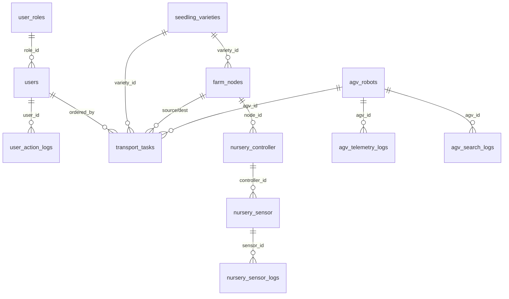

# 📘 DB 스키마 레퍼런스 (smart_farm_v2)

> **이 문서는 모든 코드 작성 시 반드시 참조해야 하는 DB 스키마 명세입니다.**
> 테이블명, 컬럼명, 데이터 타입, PK/FK 관계를 100% 준수하여 코드를 작성하세요.
>
> - DB: MySQL / MariaDB
> - Host: AWS EC2 (`3.35.24.94`)
> - Database: `smart_farm_v2`

---

## 🔵 1. 사용자 및 권한 관리

### 1-1. `user_roles` (권한 그룹)

| 컬럼명 | 타입 | 제약 | 설명 |
|--------|------|------|------|
| `role_id` | INT | **PK** | 권한 그룹 고유 ID |
| `role_code` | VARCHAR(20) | **UK** | 권한 식별 코드 (예: `SYS_ADMIN`) |
| `role_name` | VARCHAR(50) | | 권한명 |
| `can_manual_control` | BOOLEAN | | 하드웨어 수동 제어 권한 |
| `can_edit_master` | BOOLEAN | | 마스터 데이터 수정 권한 |

### 1-2. `users` (사용자 계정)

| 컬럼명 | 타입 | 제약 | 설명 |
|--------|------|------|------|
| `user_id` | INT | **PK** | 사용자 고유 ID |
| `role_id` | INT | **FK** → `user_roles.role_id` | 권한 그룹 ID |
| `login_id` | VARCHAR(50) | **UK** | 로그인 아이디 |
| `password_hash` | VARCHAR(255) | | 암호화된 비밀번호 |
| `user_name` | VARCHAR(50) | | 사용자 실명 |
| `phone_number` | VARCHAR(20) | | 연락처 |
| `is_active` | BOOLEAN | | 계정 활성화 여부 |
| `last_login_at` | TIMESTAMP | | 마지막 접속 시간 |
| `created_at` | TIMESTAMP | | 계정 생성일 |

### 1-3. `user_action_logs` (사용자 행동 로그)

| 컬럼명 | 타입 | 제약 | 설명 |
|--------|------|------|------|
| `log_id` | BIGINT | **PK** | 행동 로그 ID |
| `user_id` | INT | **FK** → `users.user_id` | 실행한 사용자 |
| `target_system` | ENUM | | 제어 대상 시스템 (`NURSERY_CTRL` 등) |

---

## 🟢 2. 농장 구역 및 품종

### 2-1. `seedling_varieties` (품종 마스터)

| 컬럼명 | 타입 | 제약 | 설명 |
|--------|------|------|------|
| `variety_id` | INT | **PK** | 묘종 고유 ID |
| `crop_name` | VARCHAR(50) | | 작물명 (예: 딸기) |
| `variety_name` | VARCHAR(100) | | 세부 품종명 (예: 설향) |
| `supplier` | VARCHAR(100) | | 공급처 |
| `opt_temp_day` | DECIMAL(5,2) | | 주간 목표 온도 |
| `opt_temp_night` | DECIMAL(5,2) | | 야간 목표 온도 |
| `opt_humidity` | DECIMAL(5,2) | | 목표 습도 |
| `opt_ec` | DECIMAL(4,2) | | 목표 양액 농도 |
| `opt_ph` | DECIMAL(4,2) | | 목표 산성도 |
| `opt_light_dli` | DECIMAL(5,2) | | 일적산광량(DLI) |
| `days_to_harvest` | INT | | 정식 후 수확 일수 |
| `disease_resistance` | VARCHAR(255) | | 내병성 특징 |
| `characteristics` | TEXT | | 기타 메모 |
| `is_active` | BOOLEAN | | 사용 여부 |

### 2-2. `farm_nodes` (구역별 노드)

| 컬럼명 | 타입 | 제약 | 설명 |
|--------|------|------|------|
| `node_id` | VARCHAR(50) | **PK** | 물리적 노드 ID (RFID/Tag) |
| `current_variety_id` | INT | **FK** → `seedling_varieties.variety_id` | 식재된 품종 ID |
| `node_name` | VARCHAR(100) | | 노드 명칭 |
| `node_type` | ENUM | | 노드 역할 (`STATION`, `PATH` 등) |
| `controller_mac` | VARCHAR(17) | | 환경 제어 보드 MAC |
| `current_quantity` | INT | | 현재 적재된 수량 |
| `max_capacity` | INT | | 최대 수용 수량 |
| `pos_x` | INT | | 관제 UI 도면상 X 좌표 |
| `pos_y` | INT | | 관제 UI 도면상 Y 좌표 |
| `is_active` | BOOLEAN | | 노드 사용 가능 여부 |

> [!IMPORTANT]
> `node_id`는 **VARCHAR(50)** 이다 (INT 아님). 코드에서 `node_id` 파라미터 타입을 `str`로 사용할 것.

---

## 🟡 3. 무인 운반차 (AGV / Line Tracer)

### 3-1. `agv_robots` (AGV 마스터)

| 컬럼명 | 타입 | 제약 | 설명 |
|--------|------|------|------|
| `agv_id` | VARCHAR(20) | **PK** | 차량 고유 ID |
| `mac_address` | VARCHAR(17) | **UK** | 통신 모듈 MAC |
| `model_name` | VARCHAR(50) | | 기체 모델명 |
| `current_status` | ENUM | | 현재 상태 (`IDLE`, `MOVING`, `WORKING`, `CHARGING`, `ERROR`) |
| `battery_level` | INT | | 배터리 잔량(%) |
| `last_ping` | TIMESTAMP | | 마지막 통신 시간 |

### 3-2. `transport_tasks` (운송 지시 작업)

| 컬럼명 | 타입 | 제약 | 설명 |
|--------|------|------|------|
| `task_id` | INT | **PK** | 작업 고유 ID |
| `agv_id` | VARCHAR(20) | **FK** → `agv_robots.agv_id` | 할당된 기체 ID |
| `variety_id` | INT | **FK** → `seedling_varieties.variety_id` | 운반 품종 ID |
| `source_node` | VARCHAR(50) | **FK** → `farm_nodes.node_id` | 출발지 노드 |
| `destination_node` | VARCHAR(50) | **FK** → `farm_nodes.node_id` | 목적지 노드 |
| `ordered_by` | INT | **FK** → `users.user_id` | 지시자 ID |
| `quantity` | INT | | 운반 수량 |
| `task_status` | ENUM | | 진행 상태 (`PENDING`, `IN_PROGRESS`, `COMPLETED`, `FAILED`) |
| `ordered_at` | TIMESTAMP | | 지시 시각 |
| `started_at` | TIMESTAMP | | 작업 시작 시각 |
| `completed_at` | TIMESTAMP | | 작업 완료 시각 |

### 3-3. `agv_telemetry_logs` (주행 로그)

| 컬럼명 | 타입 | 제약 | 설명 |
|--------|------|------|------|
| `log_id` | BIGINT | **PK** | 로그 고유 ID |
| `agv_id` | VARCHAR(20) | **FK** → `agv_robots.agv_id` | 기체 ID |
| `task_id` | INT | **FK** → `transport_tasks.task_id` | 수행 중인 작업 ID |
| `logged_at` | TIMESTAMP | | 로그 발생 시간 |

### 3-4. `agv_search_logs` (작업 로그)

| 컬럼명 | 타입 | 제약 | 설명 |
|--------|------|------|------|
| `log_id` | BIGINT | **PK** | 로그 고유 ID |
| `agv_id` | VARCHAR(20) | **FK** → `agv_robots.agv_id` | 기체 ID |
| `task_id` | INT | **FK** → `transport_tasks.task_id` | 수행 중인 작업 ID |
| `current_motor` | INT | | 서보 모터 각도 |
| `logged_at` | TIMESTAMP | | 로그 발생 시간 |

---

## 🟣 4. 육묘장 환경 제어

### 4-1. `nursery_controller` (제어기 마스터)

| 컬럼명 | 타입 | 제약 | 설명 |
|--------|------|------|------|
| `controller_id` | VARCHAR(50) | **PK** | 제어기 ID |
| `node_id` | VARCHAR(50) | **FK** → `farm_nodes.node_id` | 설치된 구역 노드 ID |
| `mac_address` | VARCHAR(17) | **UK** | 보드 MAC 주소 |
| `ip_address` | VARCHAR(15) | | 내부 IP |
| `control_mode` | ENUM | | 동작 모드 (`AUTO`, `MANUAL`) |
| `device_status` | ENUM | | 통신 상태 (`ONLINE`, `OFFLINE`) |
| `last_heartbeat` | TIMESTAMP | | 마지막 통신 수신 시간 |

### 4-2. `nursery_sensor` (센서 마스터)

| 컬럼명 | 타입 | 제약 | 설명 |
|--------|------|------|------|
| `sensor_id` | INT | **PK** | 센서 고유 식별 번호 |
| `controller_id` | VARCHAR(50) | **FK** → `nursery_controller.controller_id` | 연결된 제어기 ID |
| `sensor_type` | VARCHAR(50) | | 센서 종류 (예: `DHT22`) |
| `pin_number` | INT | | ESP32 연결 핀 번호 |

### 4-3. `nursery_sensor_logs` (센서 수집 로그)

| 컬럼명 | 타입 | 제약 | 설명 |
|--------|------|------|------|
| `log_id` | BIGINT | **PK** | 센서 로그 번호 |
| `sensor_id` | INT | **FK** → `nursery_sensor.sensor_id` | 센서 ID |
| `value` | DECIMAL(10,2) | | 실제 측정값 |
| `measured_at` | TIMESTAMP | | 데이터 측정 시각 |

### 4-4. `nursery_actuator_logs` (구동기 제어 로그)

| 컬럼명 | 타입 | 제약 | 설명 |
|--------|------|------|------|
| `log_id` | BIGINT | **PK** | 액추에이터 동작 로그 번호 |
| `actuator_id` | INT | **FK** | 동작한 구동기 ID |
| `state_value` | VARCHAR(10) | | 변경된 상태 (`ON`, `OFF` 등) |
| `triggered_by` | VARCHAR(50) | | 동작 원인 (`AUTO_LOGIC`, `MANUAL` 등) |
| `logged_at` | TIMESTAMP | | 동작 시각 |

---

## 🔗 ER 관계도 요약

